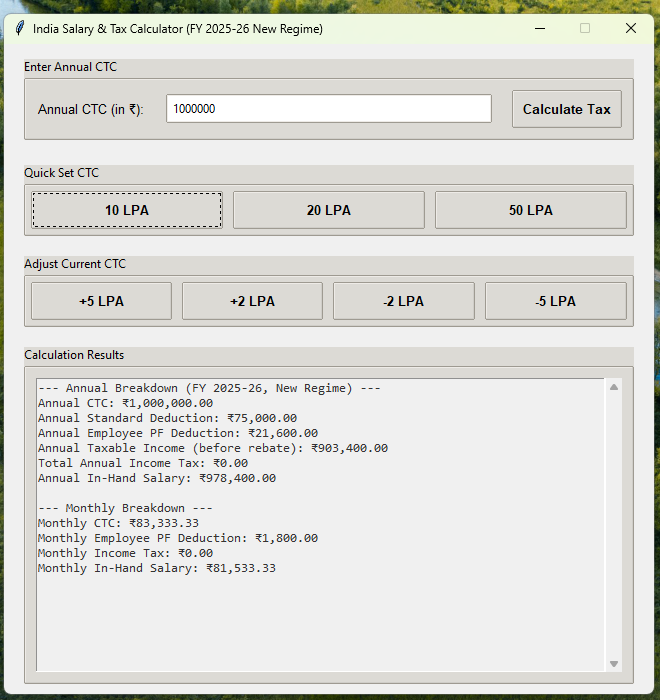

# 💰 India Salary & Tax Calculator (FY 2025-26 - New Regime)

A desktop application built using Python's Tkinter library that calculates the **annual and monthly salary breakdown** as per **India’s New Tax Regime** for the **financial year 2025-26**.

---

## 📌 Features

- Enter your **Annual CTC (Cost to Company)** and get:
  - Employee PF deductions
  - Standard deductions
  - Taxable income
  - Income tax (with health & education cess)
  - Final **in-hand salary** (monthly & yearly)

- Includes:
  - **Quick LPA Set Buttons** (e.g., 10 LPA, 20 LPA, 50 LPA)
  - **CTC Adjustment Buttons** (add/subtract 2 LPA or 5 LPA)
  - Smart **error handling and validation**

---

## 🧮 Tax Calculation Logic

- **New Tax Regime** slabs for FY 2025–26
- Assumes **Basic + DA = 50% of CTC**
- PF calculated at **12% of Basic + DA** (capped at ₹15,000/month)
- **Standard Deduction**: ₹75,000
- **87A Rebate**: ₹60,000 for income ≤ ₹12,00,000
- **Health & Education Cess**: 4% on tax

---

## 🛠️ Tools & Technologies

| Tool | Purpose |
|------|---------|
| **Python 3.x** | Core programming language |
| **Tkinter** | GUI library for building desktop apps |
| **ttk / ttk.Style** | Themed widgets for modern UI |
| **ScrolledText** | Scrollable result display |
| **messagebox** | Alerts and error messages |

---

## 🚀 How to Run the Application

### 🧱 Prerequisites

- Python 3.6 or above installed on your system.
- Tkinter (usually included with standard Python distributions)

### 🏁 Run Instructions

1. **Clone this repository**:
   ```bash
   git clone https://github.com/SenKVarghese/Salary-Calculator-From-CTC.git
   cd india-salary-tax-calculator


2. **Run the Python script:**:
   ```bash
   python Salary_Calculator.py

- (Make sure the filename matches your saved Python file)   


3. The GUI window will open where you can enter your Annual CTC and explore salary breakdowns interactively.

## 📷 Screenshots

### GUI Entry and Result Display


### Result with Sample Calculation


---

## 📚 Folder Structure

```
.
├── salary_tax_calculator.py  # Main application code
├── README.md                 # Project documentation
```

---

## 🧾 License

This project is open source and free to use under the [MIT License](https://opensource.org/licenses/MIT).

---

## 🙋‍♂️ Author

Developed by SEN K VARGHESE 
📧 senkvarghese316@gmail.com

---

## ⭐️ Show Your Support

If you found this helpful:

- ⭐️ Star this repository
- 🛠️ Fork it to improve it
- 🧠 Share your feedback or ideas
